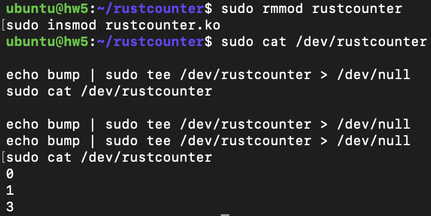

# rustcounter

Author: Marleena Rose Limbrick

`rustcounter` is a Linux kernel module written in Rust. It creates a character device at `/dev/rustcounter` that stores a single atomic counter.

- Reading from the device prints the current counter value
- Writing to the device increments the counter

## Demo



Example session:

```bash
$ sudo cat /dev/rustcounter
0

$ echo bump | sudo tee /dev/rustcounter > /dev/null
$ sudo cat /dev/rustcounter
1

$ echo bump | sudo tee /dev/rustcounter > /dev/null
$ echo bump | sudo tee /dev/rustcounter > /dev/null
$ sudo cat /dev/rustcounter
3
```
## Code Tour

Interesting parts of the implementation:

- `module!` registers the kernel module metadata and connects the module to the Linux kernel.
- `MiscDeviceRegistration::register()` creates the `/dev/rustcounter` character device.
- `write_iter()` increments the counter using `AtomicU64::fetch_add`.
- `read_iter()` converts the counter value into a string and returns it to userspace.
- `CONSUMED.swap(true, Ordering::SeqCst)` ensures reads behave like EOF until another write occurs.
---

## Build

```bash
make clean && make
```

---

## Load the Module

```bash
sudo insmod rustcounter.ko
```

Verify that the device exists:

```bash
ls -la /dev/rustcounter
```

Example output:

```text
crw------- 1 root root 10, 263 May 8 01:25 /dev/rustcounter
```

---

## Testing the Counter

Read the initial value:

```bash
sudo cat /dev/rustcounter
```

Increment the counter:

```bash
echo bump | sudo tee /dev/rustcounter > /dev/null
```

Read again:

```bash
sudo cat /dev/rustcounter
```

Increment two more times:

```bash
echo bump | sudo tee /dev/rustcounter > /dev/null
echo bump | sudo tee /dev/rustcounter > /dev/null
```

Read the updated value:

```bash
sudo cat /dev/rustcounter
```

Expected output sequence:

```text
0
1
3
```

---

## Unload the Module

```bash
sudo rmmod rustcounter
```

---
## Why This Is Interesting

This project demonstrates how Rust can safely interact with Linux kernel APIs while avoiding many common kernel-space bugs found in C implementations.

The module uses `AtomicU64` instead of mutex-based synchronization, allowing concurrent writes without race conditions. Because the counter uses atomic operations directly, the implementation remains simple while still being thread-safe.

This project also demonstrates:
- Linux miscdevice registration
- Character device interfaces in kernel space
- Rust-for-Linux development workflows
- Safe kernel memory handling in Rust

## Future Work

Potential future improvements include:

- Supporting decrement and reset commands
- Adding a `/proc/rustcounter` statistics interface
- Tracking per-process counters
- Adding configurable limits for the counter
- Logging write timestamps
- Supporting blocking reads and polling
  
## Implementation Notes

This project demonstrates:

- Writing Linux kernel modules in Rust
- Using the Linux `miscdevice` subsystem
- Creating character devices in kernel space
- Atomic synchronization with `AtomicU64`
- Safe kernel development patterns in Rust

The counter value is stored using atomic operations instead of mutexes, allowing thread-safe increments from multiple writes.

